# TP 0 : JSP, Servlet et Hibernate avec DAO générique et Jakarta EE

## Technologies utilisées
- Java 17

- Jakarta EE (Servlet 5.0)

- Hibernate ORM 6

- Maven

- MySQL (XAMPP)

- Apache Tomcat 10

## Strecture de projet
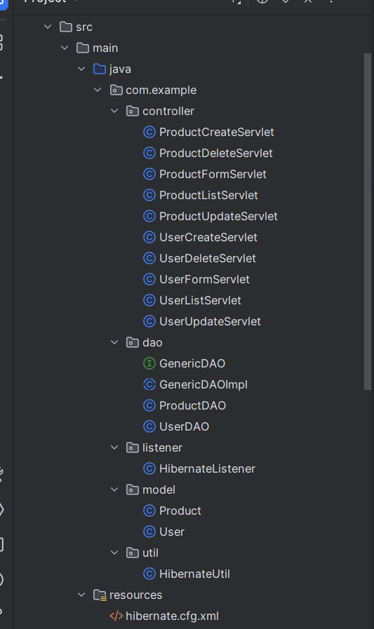
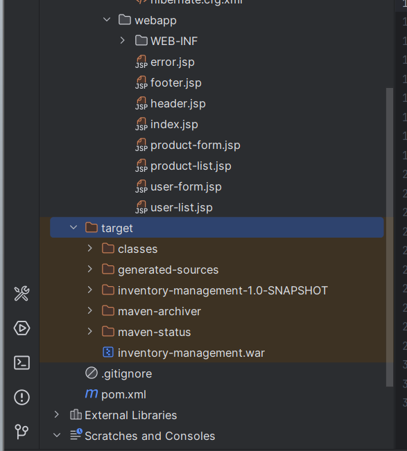
---

## Page d'accueil
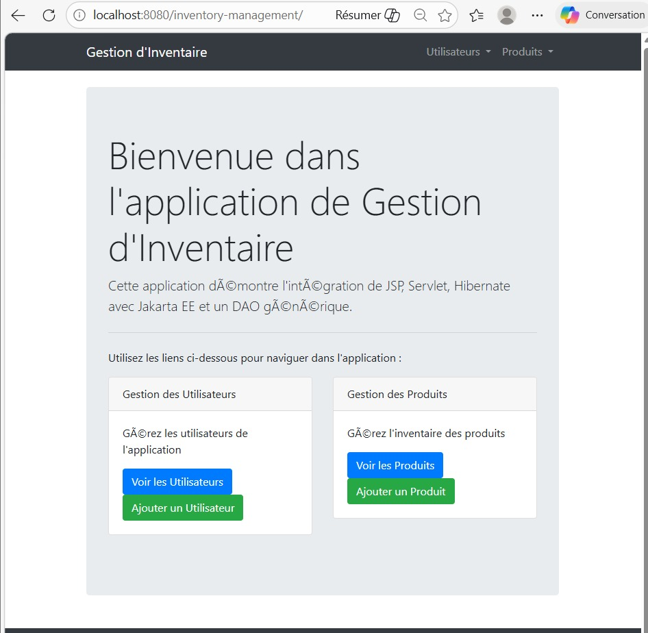
---

## Gestion des utilisateurs

### 1- Ajouter un utilisateur
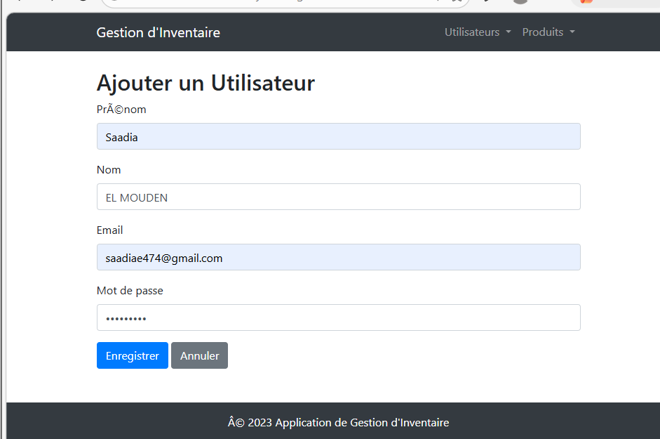

### 2- Modifier un utilisateur
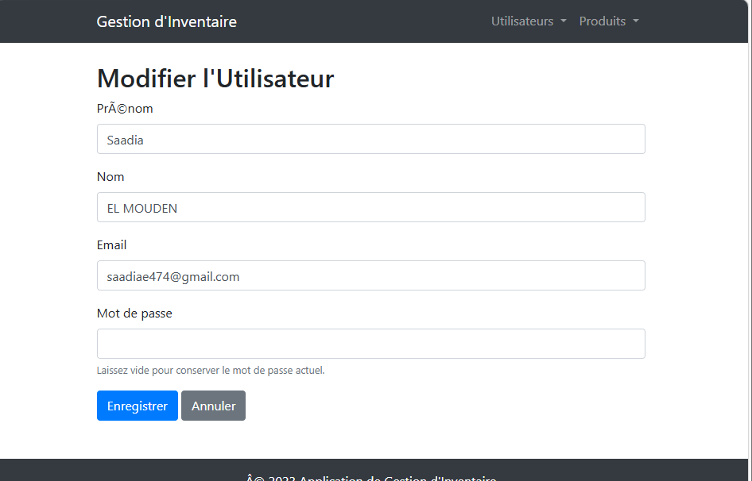

### 3- Supprimer un utilisateur
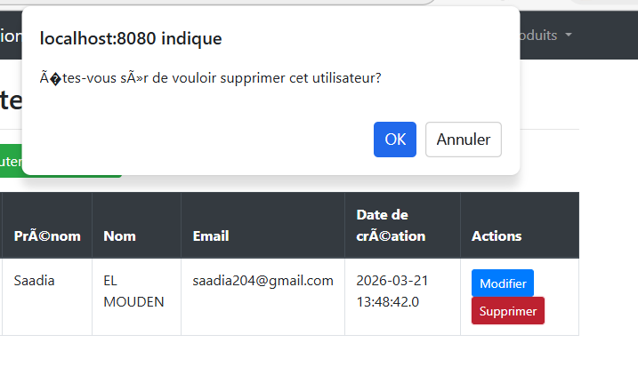
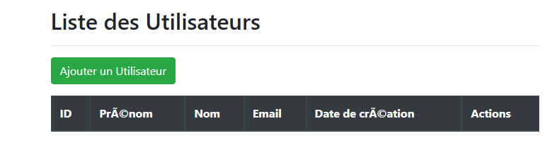

---
## Gestion des produits
### 1- Ajouter un produit
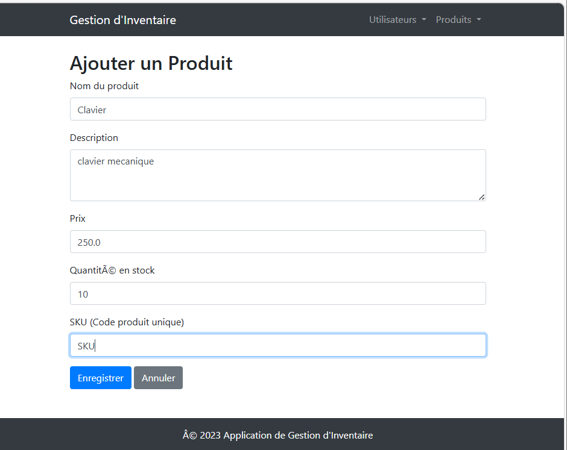
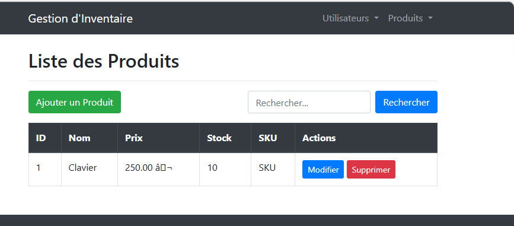

### 2- Rechercher un produit
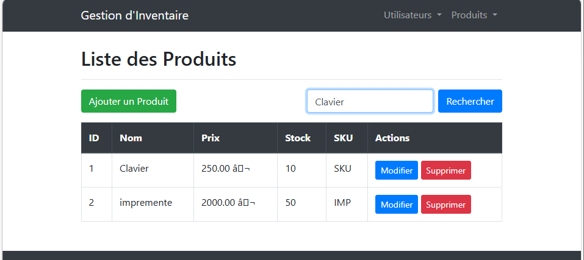
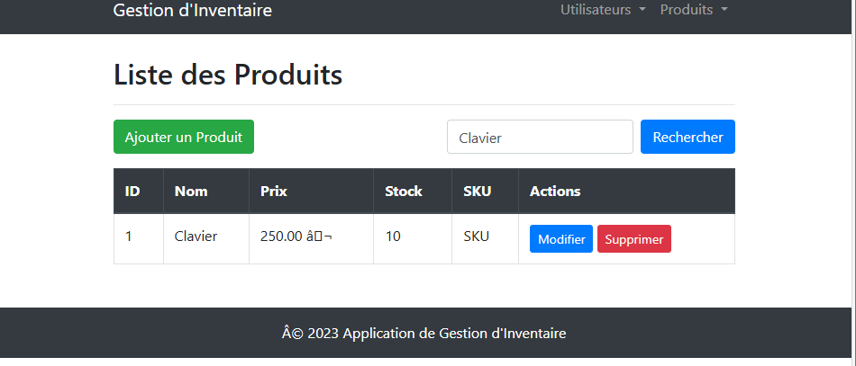

### 3- Modifier un produit
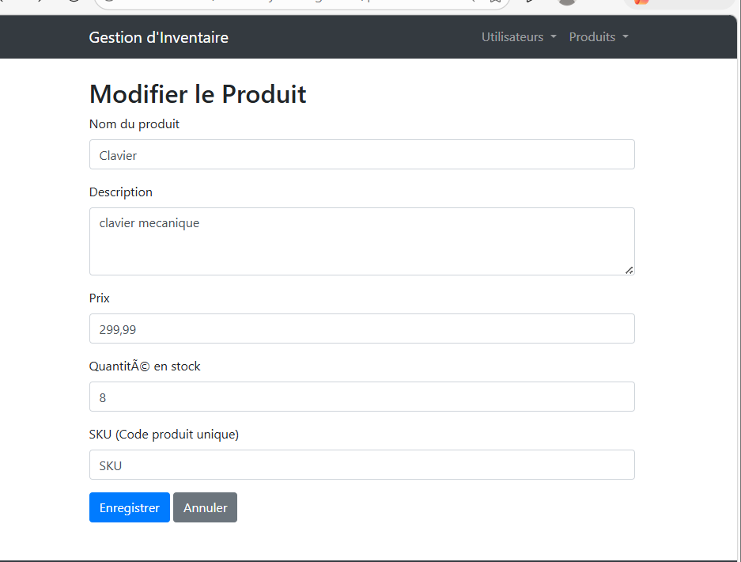

### 4- Supprimer un produit 
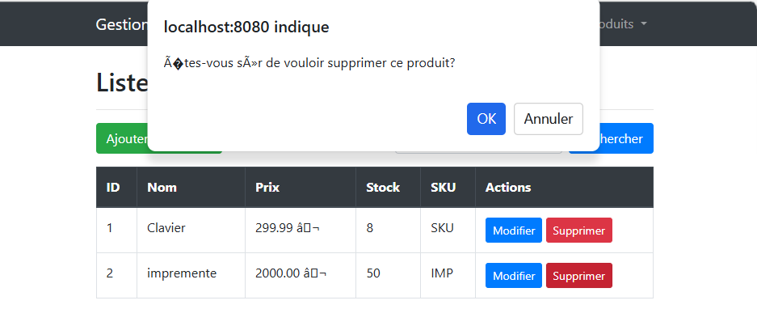
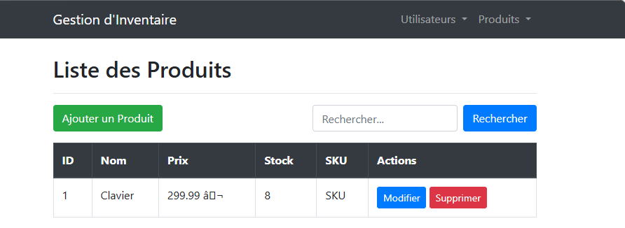
